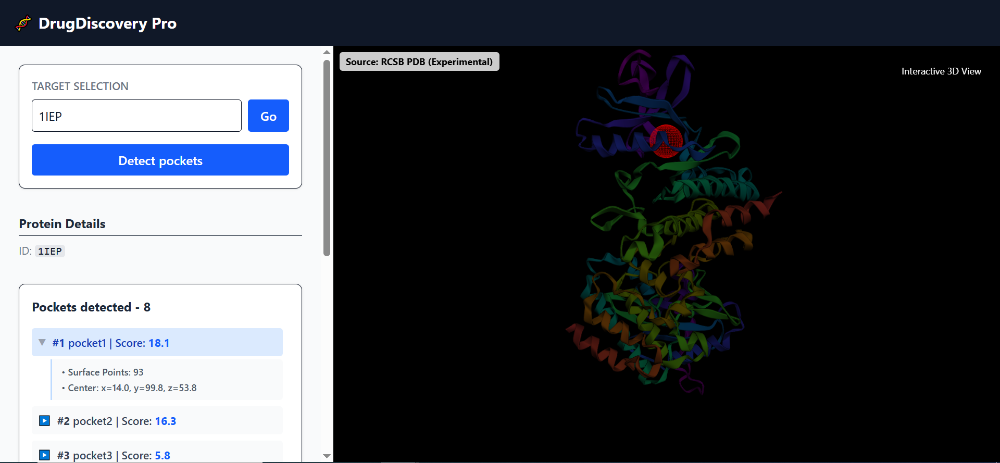

# 🧬 Drug Discovery AI Platform

[](https://opensource.org/licenses/MIT)
[](https://www.python.org/downloads/)
[](https://reactjs.org/)

An end-to-end prototype for AI-assisted drug discovery, focusing on the early structural stage of the drug discovery pipeline. This platform streamlines the workflow from protein structure retrieval to binding pocket identification and interactive 3D visualization.

## 🚧 Project Status

This project is an active research and engineering prototype.

Current focus:
- Protein structure retrieval
- Binding pocket detection
- Interactive 3D visualization

Planned next steps:
- Docking integration
- Ligand scoring
- Dataset benchmarking


## 🎯 Project Objective
The goal is to provide a reproducible and scalable environment to explore protein-ligand interactions. By integrating experimental data with AI-driven predictions (AlphaFold), the platform helps researchers identify potential therapeutic targets more efficiently.

## ✨ Key Features
- **Smart Structure Retrieval**:
  - Direct fetch from **RCSB Protein Data Bank** (Experimental structures).
  - Fallback to **AlphaFold DB** (AI-predicted models) for orphan proteins.
- **Automated Binding Pocket Detection**: Uses **P2Rank** (machine learning-based) to predict ligand-binding sites.
- **Interactive 3D Visualization**: 
  - High-performance rendering via **3Dmol.js**.
  - Visual overlays of predicted pockets (SAS points and center spheres).
  - Dynamic style controls (Cartoon, Stick, Sphere).

## 🏗️ Architecture Overview
The project follows a modern microservices-inspired architecture:

- **Frontend**: React + Vite + TailwindCSS.
- **Backend Service**: FastAPI (Python) orchestrating bioinformatics tools and data parsing.
- **Bioinformatics Engine**: P2Rank (CLI-based analysis).


## 💻 Local Installation

### 1. Prerequisites
- **Node.js** (v16+)
- **Python** (v3.9+)
- **Git Bash** (recommended on Windows to execute the P2Rank CLI)
- **Java JDK** (v11 or later) — required to run P2Rank
- **P2Rank** (installed locally)

### 2. Clone the Repository
```bash
git clone https://github.com/Mohamed-dev0/drug-discovery-ai-platform.git
cd drug-discovery-ai-platform
```
### 3. Backend Setup
1. Navigate to the backend directory:
```bash
cd microservices  
```
2. Create and activate a virtual environment:
```bash
python -m venv venv
# Windows:
.\venv\Scripts\activate
# Linux/Mac:
source venv/bin/activate
```
3. Install dependencies:
```bash
pip install -r requirements.txt
```

4. Environment Variables: Create a .env file in the backend root:
> ⚠️ The `.env` file is not tracked by Git.  
> Use it to configure local paths and secrets.

```bash
GIT_BASH="C:\Program Files\Git\bin\bash.exe"
P2RANK_DISTRO=.\p2rank\distro
P2RANK_BIN=.\p2rank\distro\prank
ALLOWED_ORIGINS=http://localhost:5173
```
5. Launch the server:
```bash
uvicorn main:app --reload
```
### 4. Frontend Setup

```bash
cd frontend
npm install
npm run dev
```

## 🛠️ Basic Usage & Workflow
To verify that the platform is running correctly, follow this standard workflow:
1. Target Selection: Enter a PDB ID (e.g., 1IEP - Abelson tyrosine kinase) in the search bar.
2. Retrieve: Click "Go" to fetch and visualize the 3D structure.
3. Analyze: Click "Detect Pockets". The backend will run P2Rank analysis.
4. Inspect:
- A list of predicted pockets will appear.
- Select Pocket #1 (the highest scoring site).
- A red semi-transparent sphere will appear in the 3D viewer, highlighting the active site where a drug molecule could bind.

## 📸 Screenshots


## 📄 License
This project is licensed under the MIT License.

